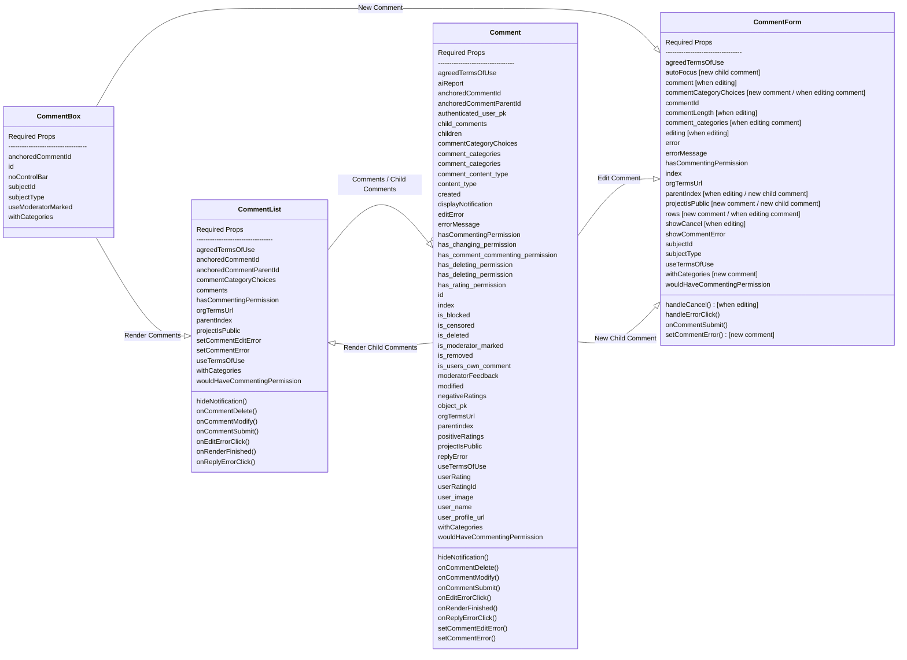

# Comments
Work in progress documentation of the comment code structure

## React

### Class Diagram
The below diagram describes the dependencies between the main comment components
and the props they require to work.

